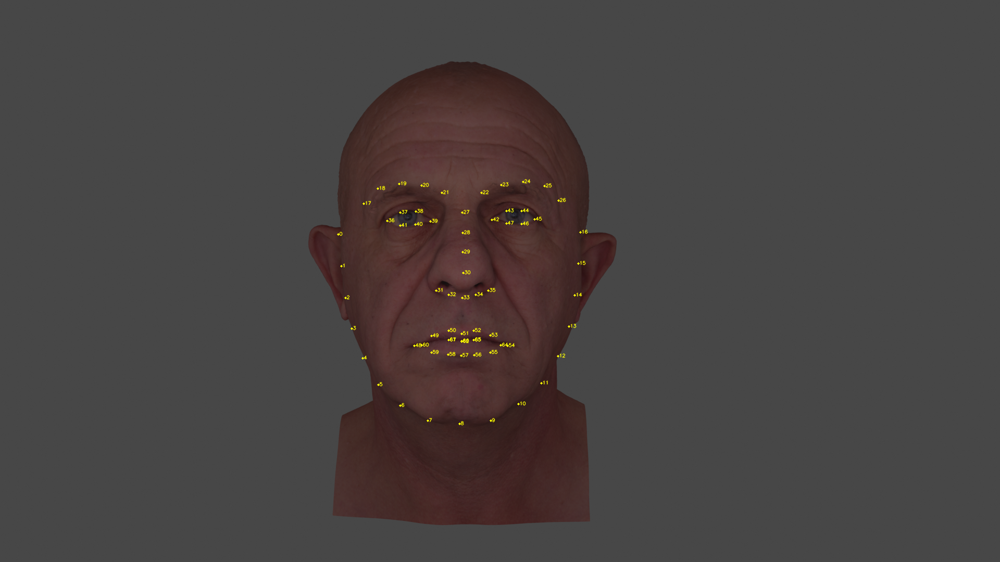

# Auto Keypoint Extractor for Retopology
The idea of this tool is to extract the facial keypoints of a texture, mark the vertices and export the information for retopology tools like [R3DS Wrap](https://www.russian3dscanner.com/).

### Process

1. Render camera image
3. Detect facial landmark keypoints
4. Project vertices to camera space
5. Find vertices that match detected keypoints
5. Read uv coordinates of selected vertices by using a KDTree
6. Export index and uv coordinates



### Installation

#### Windows
Install [Visual Studio Build Tools](https://visualstudio.microsoft.com/thank-you-downloading-visual-studio/?sku=BuildTools&rel=15) and make sure `cmake.exe` is in the path variable.

```bash
python3 -m ensurepip
python3 -m pip install --upgrade pip --user
python3 -m pip install cmake
python3 -m pip install opencv-python opencv-contrib-python imutils numpy scipy dlib --user
```

### MacOS

```bash
./python3.7m -m ensurepip
./python3.7m -m pip install --upgrade pip --user
./python3.7m -m pip install opencv-python opencv-contrib-python imutils numpy scipy dlib --user

# dlib from source if needed
python3.7m setup.py install
```

#### Landmark Model

You can download it here
[http://dlib.net/files/shape_predictor_68_face_landmarks.dat.bz2](http://dlib.net/files/shape_predictor_68_face_landmarks.dat.bz2) or [here](https://github.com/AKSHAYUBHAT/TensorFace/blob/master/openface/models/dlib/shape_predictor_68_face_landmarks.dat).

### Development

To have autocompletion in various IDE's for blender, install the following package:

```bash
pip3 install fake-bpy-module-2.80
```
